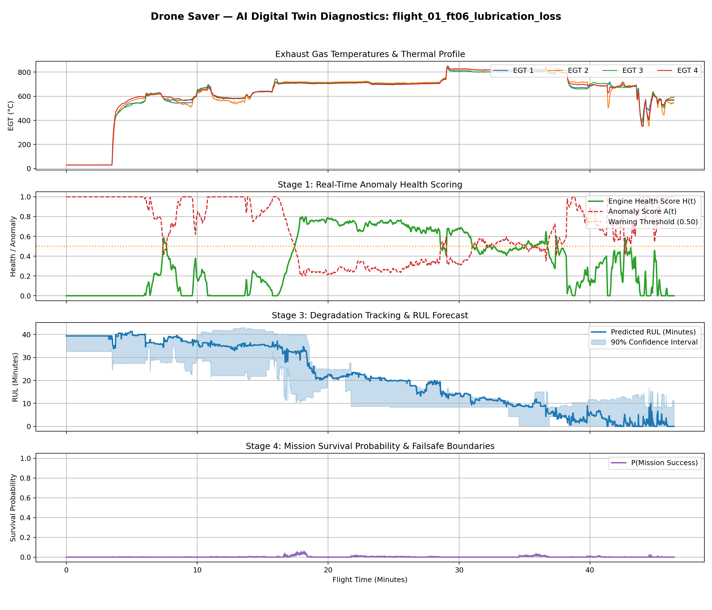

# Drone Saver — AI Digital Twin Mission Diagnostic Report: `flight_01_ft06_lubrication_loss`
**Project:** Drone Saver (SIH26054 — DRDO)
**Total Evaluated Telemetry Duration:** 2,786 seconds (46.4 flight minutes)

---
## Executive Diagnostic Summary

| Metric | Assessment / Value | Status |
| :--- | :--- | :--- |
| **Overall Engine Health Score** | `0.000` (Minimum during flight: `0.000`) | 🔴 DEGRADED |
| **Primary Detected Fault Class** | `FT-06_LUBRICATION_LOSS` | ⚠️ ACTIVE |
| **Isolated Faulty Cylinder** | `Cylinder #0` (0 = Global Engine) | ⚠️ ISOLATED |
| **Predicted Remaining Useful Life** | `0.0 flight minutes` | ⚠️ CRITICAL |
| **Mission Risk Level** | `LOW (NOMINAL)` | - |
| **Operator / Autopilot Directive** | `CONTINUE_MISSION` | - |

---
## Multi-Stage Digital Twin Architecture Telemetry
- **Stage 1 (Anomaly Detection):** Isolation Forest evaluated on 20-dimensional physics residuals.
- **Stage 2 (Fault Classification):** Gradient Boosted classifier on 85 physics-derived multi-cylinder features.
- **Stage 3 (RUL Prognostics):** Dual-quantile regression trees estimating median RUL and 90% confidence bounds.
- **Stage 4 (Mission Reliability):** Monte Carlo survival simulation evaluating in-flight loiter survivability.

